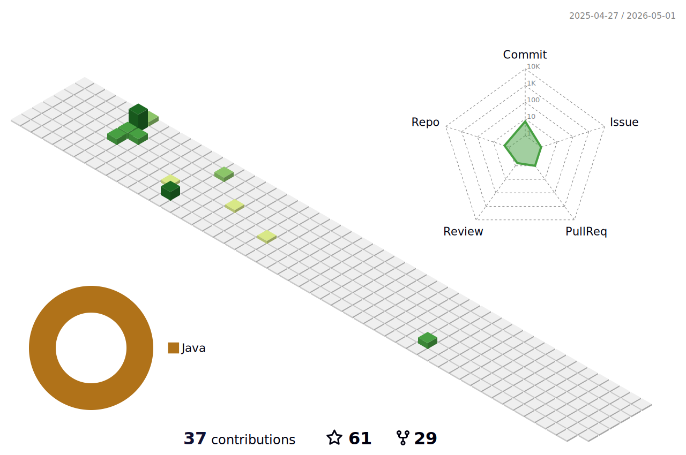

### Hi there 👋

* gitee: [https://gitee.com/FutaoSmile](https://gitee.com/FutaoSmile)
* 简书: [https://www.jianshu.com/u/9e2e579df7dd](https://www.jianshu.com/u/9e2e579df7dd)
* 微信公众号: 喜欢天文

<!--
**FutaoSmile/FutaoSmile** is a ✨ _special_ ✨ repository because its `README.md` (this file) appears on your GitHub profile.

Here are some ideas to get you started:

- 🔭 I’m currently working on ...
- 🌱 I’m currently learning ...
- 👯 I’m looking to collaborate on ...
- 🤔 I’m looking for help with ...
- 💬 Ask me about ...
- 📫 How to reach me: ...
- 😄 Pronouns: ...
- ⚡ Fun fact: ...
-->

[see more... ](https://github.com/anuraghazra/github-readme-stats/blob/master/docs/readme_cn.md)
