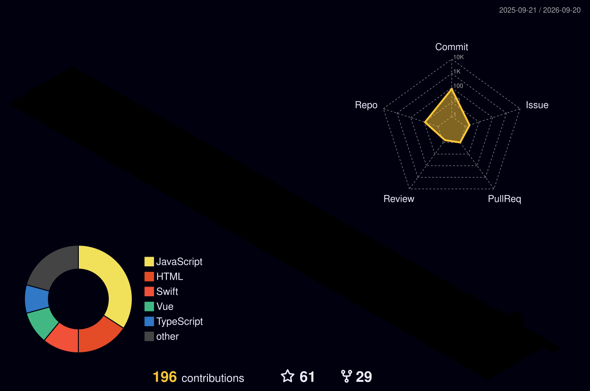

# 👋 Hello, I'm idle fish

**🧪 QA Engineer · 🍎 macOS & Java · 🤖 AI Tinkerer**

📍 Hangzhou, China 🇨🇳

---

## 📊 GitHub Stats

  

  
  

  

## 📈 Contribution Graph

## 🗓️ 3D Contribution

  

## 🛠️ Tech Stack

  

## 🚀 Featured Projects

- **🖥️ [chatgpt-proxy-launcher](https://github.com/FutaoSmile/chatgpt-proxy-launcher)** — macOS launcher that fixes ChatGPT desktop "Reconnecting x/5 / request timed out" — built end-to-end by DSH 
- **⚡ [ChargeWatt](https://github.com/FutaoSmile/ChargeWatt)** — native macOS menu bar utility for battery & CPU throttling telemetry 
- **📡 [claude-pulse](https://github.com/FutaoSmile/claude-pulse)** — floating macOS status panel monitoring Claude Code sessions 
- **🛠️ [ResponseRewriter](https://github.com/FutaoSmile/ResponseRewriter)** — Chrome extension that intercepts & rewrites API responses 
- **📖 [posy-pip-picture-book](https://github.com/FutaoSmile/posy-pip-picture-book)** — interactive children's picture book, pure front-end, zero dependencies 

## ✨ About Me

- 🧪 **QA Engineer** who loves breaking things — then fixing them better
- 🍎 **macOS enthusiast** — building native menu bar apps (Swift) for fun
- ☕ **Java by day** — Spring Boot, MongoDB, microservices
- 🤖 **AI tinkerer** — Claude Code, Codex, ChatGPT, and DSH (DeepSeek Harness) automation
- 🌱 Always learning: Rust, clean architecture, and writing better tests

## 📫 Let's Connect

  

---

  

